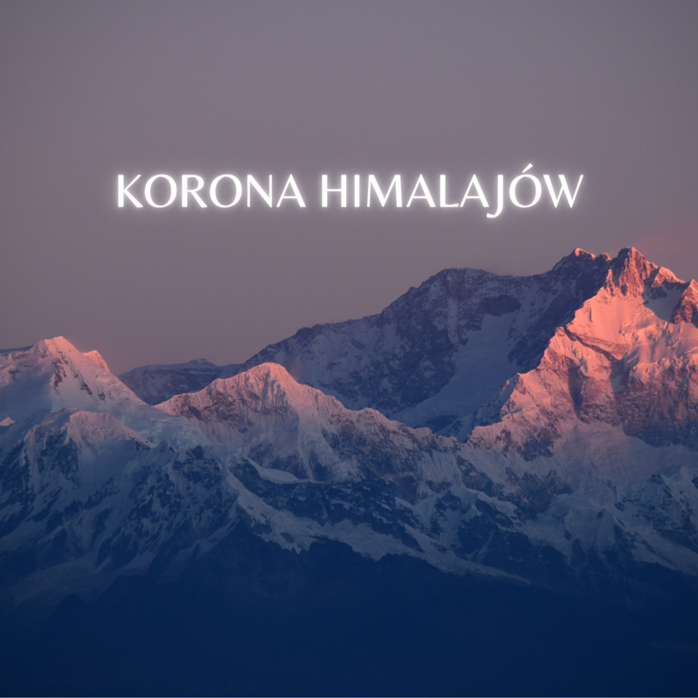

# The 14 Highest Peaks of the World

## Description

This is a website about people who have climbed the 14 highest peaks in the world.
I chose four that I want to write about. Three of them are Polish.

1. Reinhold Messner  🇮🇹
2. Jerzy Kukuczka  🇵🇱
3. Krzysztof Wielicki  🇵🇱
4. Piotr Pustelnik  🇵🇱

## Demo

## Features

- Height and name of each peak
- Find out who and when was the first to reach each of the world's 8,000m peaks
- First winter ascent of every peak
- Some information about four Himalayan climbers

All this information you can find here: https://o-pawel.github.io/top-of-himalayas/

## Technolohies used in this project:
- HTML
- CSS
- JS 
- BEM
